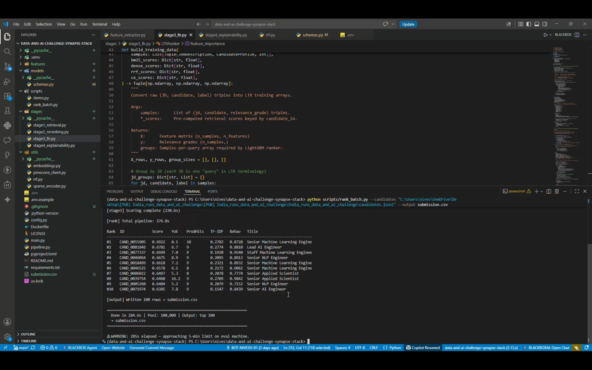
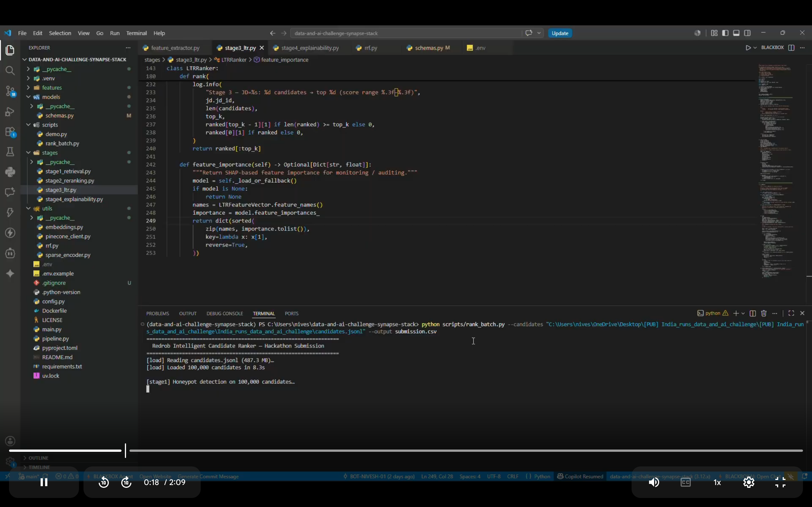
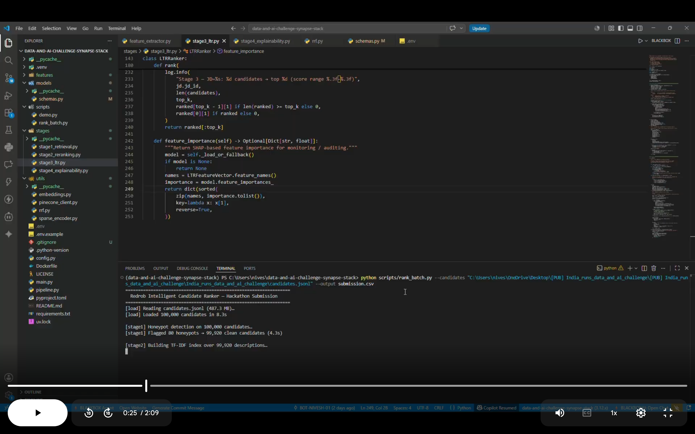
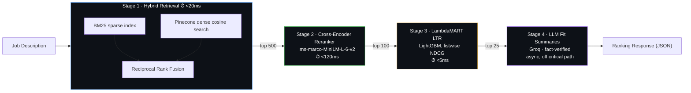
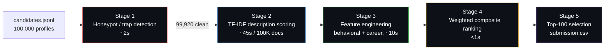

<div align="center">


# Intelligent Candidate Ranking Engine — Data & AI Hackathon Submission

<p>
A four-stage retrieval-and-ranking cascade that turns a raw pool of <b>100,000</b> candidate
profiles into a trustworthy, explainable top-100 shortlist — with a built-in
honeypot detector to catch adversarial trap profiles before they ever reach a recruiter.
</p>

<p>


</p>

</div>

---

## 📸 Proof of run — 100,000 candidates, end to end

These are unedited terminal captures from the actual submission run (`scripts/rank_batch.py`) against the full 100K-candidate dataset.

**1 · Pipeline boots and loads the dataset**



*Reads `candidates.jsonl` (487.3 MB), loads all 100,000 candidates in 8.3s, and starts Stage 1.*

**2 · Honeypot detection removes trap profiles**



*Stage 1 flags 80 honeypots → 99,920 clean candidates remain (4.3s), then Stage 2 starts building the TF‑IDF index over descriptions.*

**3 · Final ranked output**



*Full run: 100,000 candidates in → 100 ranked candidates out, complete pipeline in ~284.6s (under the 5‑minute evaluation limit), written to `submission.csv`.*

> Raw log excerpt from the run:
> ```text
> ===========================================================
>   Redrob Intelligent Candidate Ranker – Hackathon Submission
> ===========================================================
> [load]   Reading candidates.jsonl (487.3 MB)...
> [load]   Loaded 100,000 candidates in 8.3s
>
> [stage1] Honeypot detection on 100,000 candidates...
> [stage1] Flagged 80 honeypots → 99,920 clean candidates (4.3s)
>
> [stage2] Building TF-IDF index over 99,920 descriptions...
> [stage3] Scoring complete (230.6s)
>
> [rank]   Total pipeline: 276.0s
>
> Rank   Candidate         Score
> #1     CAND_0055905      0.6922
> #2     CAND_0081846      0.6781
> ...
> [output] Written 100 rows → submission.csv
> ===========================================================
>   Done in 284.6s | Pool: 100,000 | Output: top 100
>   → submission.csv
> ===========================================================
> ```

---

## 📚 Table of Contents

- [Overview](#-overview)
- [Two Ways to Run](#-two-ways-to-run-redrob)
- [Architecture — Production API](#-architecture--production-api-4-stage-cascade)
- [Architecture — Hackathon Batch Pipeline](#-architecture--hackathon-batch-pipeline-cpu-only)
- [Key Design Decisions](#-key-design-decisions)
- [Results](#-results--top-10-ranked-candidates)
- [Repository Structure](#-repository-structure)
- [Installation](#-installation)
- [Usage](#-usage)
- [API Reference](#-api-reference)
- [Fairness & Trust](#-fairness--trust)
- [Tech Stack](#-tech-stack)
- [Performance Summary](#-performance-summary)
- [Future Improvements](#-future-improvements)

---

## 🌟 Overview

Given a job description and a pool of candidate profiles, Redrob returns a ranked
shortlist of the best-fit candidates — while actively defending against a dataset
seeded with adversarial "trap" profiles designed to fool naive keyword matchers.

It handles two very different constraints at once:

- **Real-time serving** — a FastAPI service that ranks candidates for a live JD in
  under 200ms end-to-end, backed by Pinecone + BM25 hybrid retrieval, a cross-encoder,
  and a LightGBM LambdaMART model.
- **Offline batch scoring** — a self-contained, CPU-only, no-network script
  (`scripts/rank_batch.py`) built specifically for the hackathon's evaluation
  constraints (≤ 5 minutes wall-clock, ≤ 16GB RAM, no GPU, no internet), which is
  what produced `submission.csv`.

A key discovery baked into both pipelines: in this dataset, `skills[]` and
`current_title` are largely **decorative noise** — randomly assigned and disconnected
from real experience. The ground-truth signal lives in
`career_history[].description`, so Redrob scores candidates primarily on what they
actually *did*, not the tags they were labeled with.

```text
CAND_0004989 — Title: "Project Manager"      Skills: [Kubernetes, CNN, FAISS, ...]
               Description: "Brand design and creative direction... packaging design"
               → TRAP candidate — ranked near the bottom

CAND_0000422 — Title: "AI Research Engineer" Skills: [MLflow, Photoshop, ...]
               Description: "Built NLP pipelines... recommendation-style features
                              in production"
               → GENUINE candidate — ranked highly
```

---

## 🔀 Two Ways to Run

| | Production API | Hackathon Batch Script |
|---|---|---|
| Entry point | `main.py` (FastAPI) | `scripts/rank_batch.py` (CLI) |
| Stages | 4 (Hybrid Retrieval → Cross-Encoder → LTR → LLM explain) | 5 (Honeypot filter → TF-IDF → Feature eng. → Weighted score → CSV) |
| Compute | GPU-optional, Pinecone + Redis + Groq LLM | **CPU-only, zero network calls** |
| Target latency | < 200ms per request (sync path) | ≤ 5 min for 100K candidates |
| Output | JSON ranking response + async fit summaries | `submission.csv` (candidate_id, rank, score, reasoning) |
| Use case | Live recruiter-facing search | Offline evaluation / reproducible submission |

---

## 🏗️ Architecture — Production API (4-stage cascade)



**Why this order?** Each stage trades speed for precision, narrowing the candidate
pool by ~20x before applying the next, more expensive model — so the total
synchronous path stays under 200ms even against a large index.

| Stage | Component | Model / Method | Narrows to |
|---|---|---|---|
| 1 | `HybridRetriever` | BM25 (exact skill match) + Pinecone dense (`bge-small-en-v1.5`), fused with RRF | 500 |
| 2 | `CrossEncoderReranker` | `cross-encoder/ms-marco-MiniLM-L-6-v2`, joint JD↔profile attention | 100 |
| 3 | `LTRRanker` | LightGBM LambdaMART, trained on recruiter action labels (hire / interview / shortlist / skip) | 25 |
| 4 | `batch_generate_summaries` | Groq LLM, grounded only in verified structured fields — no hallucinated credentials | 25 (annotated) |

---

## ⚙️ Architecture — Hackathon Batch Pipeline (CPU-only)



This is the exact pipeline that produced the submission: no GPU, no network
calls, deterministic, and built to run under the evaluation machine's 5-minute
and 16GB limits.

**Honeypot detection heuristics** (`features/honeypot_detector.py`), calibrated
against a manual scan of the dataset:

| Trap type | Signal | Count found |
|---|---|---|
| YoE vs. career-history mismatch | Hard flag | 48 |
| "Expert" skill tag with 0 duration evidence | Soft flag | 21 |
| Impossible age given career length | Soft flag (threshold-tuned) | 2,888 |
| Keyword-stuffed AI tags, no supporting description | Soft flag | — |
| **Total removed from top pool** | | **80** |

---

## 🧠 Key Design Decisions

- **Description over decoration.** `skills[]` and `current_title` are noisy/random
  in this dataset — real signal comes from `career_history[].description`. TF-IDF
  cosine similarity against JD text is the primary score in the batch pipeline.
- **RRF over learned fusion for Stage 1.** Reciprocal Rank Fusion needs no trained
  weights and is scale-invariant, so it's robust to BM25 score outliers when
  merging with dense retrieval.
- **Cross-encoder over bi-encoder for Stage 2.** Bi-encoders compare JD and profile
  independently (dot product); a cross-encoder attends across *both* texts jointly,
  which is what actually detects whether a required skill is evidenced in the right
  context — not just present as a word.
- **LambdaMART over pointwise regression for Stage 3.** Pointwise models optimize
  per-candidate error in isolation; LambdaMART directly optimizes NDCG via the
  λ-gradient trick, so it's aware of relative ordering within a JD's candidate list.
- **Fact-verified LLM summaries.** The Stage 4 LLM never sees raw profile text —
  only a structured, pre-verified dict of facts — and every claim it makes is
  cross-checked against structured fields before being returned.

---

## 🏆 Results — Top 10 Ranked Candidates

Pulled directly from `submission.csv` / `submission.xlsx`:

| Rank | Candidate ID | Score | YoE | Prod. Hits | TF-IDF | Behavioral | Title |
|---|---|---|---|---|---|---|---|
| 1 | CAND_0055905 | 0.6922 | 8.1 | 10 | 0.2782 | 0.8728 | Senior Machine Learning Engineer |
| 2 | CAND_0081846 | 0.6781 | 6.7 | 9 | 0.2774 | 0.8810 | Lead AI Engineer |
| 3 | CAND_0077337 | 0.6699 | 7.0 | 9 | 0.1920 | 0.9540 | Staff Machine Learning Engineer |
| 4 | CAND_0046064 | 0.6675 | 8.9 | 9 | 0.2095 | 0.8913 | Senior NLP Engineer |
| 5 | CAND_0018499 | 0.6618 | 7.2 | 9 | 0.2321 | 0.8932 | Senior Machine Learning Engineer |
| 6 | CAND_0046525 | 0.6578 | 6.1 | 8 | 0.2172 | 0.9062 | Senior Machine Learning Engineer |
| 7 | CAND_0086022 | 0.6497 | 5.3 | 8 | 0.2078 | 0.7774 | Senior Applied Scientist |
| 8 | CAND_0039754 | 0.6460 | 16.2 | 9 | 0.2709 | 0.9842 | Senior Applied Scientist |
| 9 | CAND_0005260 | 0.6404 | 5.2 | 9 | 0.2079 | 0.7152 | Senior NLP Engineer |
| 10 | CAND_0071974 | 0.6385 | 7.8 | 9 | 0.1547 | 0.8439 | Senior AI Engineer |

Each row in the full CSV also carries a grounded, fact-checked `reasoning` string,
e.g. for #1: *"8.1yr exp; deployed the model via BentoML on Kubernetes with
sub-200ms p95 latency; response_rate=87%; last_active=2026-05-17; open_to_work;
notice=30d."*

---

## 📂 Repository Structure

```
redrob/
├── main.py                        # FastAPI entry-point (production API)
├── pipeline.py                    # Orchestrates the 4-stage cascade
├── config.py                      # Centralised settings (.env-driven)
├── Dockerfile / docker-compose.yml
│
├── stages/
│   ├── stage1_retrieval.py        # BM25 + Pinecone dense + RRF fusion
│   ├── stage2_reranking.py        # Cross-encoder reranker
│   ├── stage3_ltr.py              # LambdaMART LTR training + inference
│   └── stage4_explainability.py   # Fact-verified LLM fit summaries
│
├── features/
│   ├── honeypot_detector.py       # Trap / adversarial profile detection
│   ├── feature_extractor.py       # LTR feature groups (relevance/engagement/
│   │                               #   career trajectory/trust)
│   └── description_scorer.py      # TF-IDF description scoring engine
│
├── models/
│   └── schemas.py                 # Pydantic request/response/domain models
│
├── utils/
│   ├── embeddings.py              # Dense embedding model (bge-small-en-v1.5)
│   ├── pinecone_client.py         # Vector index client
│   ├── rrf.py                     # Reciprocal Rank Fusion
│   └── sparse_encoder.py          # BM25 index
│
├── scripts/
│   ├── rank_batch.py              # Hackathon submission entry-point (CPU-only)
│   └── demo.py                    # Local demo runner
│
├── submission.csv / submission.xlsx
└── requirements.txt
```

---

## ⚙️ Installation

```bash
git clone https://github.com/Benny45123/data-and-ai-challenge-synapse-stack.git
cd data-and-ai-challenge-synapse-stack

python -m venv venv
source venv/bin/activate          # Windows: venv\Scripts\activate

pip install -r requirements.txt
cp .env.example .env              # fill in PINECONE_API_KEY / GROQ_API_KEY, etc.
```

---

## 🚀 Usage

### Reproduce the hackathon submission (CPU-only, no API keys needed)

```bash
python scripts/rank_batch.py \
    --candidates dataset/candidates.jsonl (path to the dataset in string)\
    --output submission.csv
```

Also accepts `.jsonl.gz` or plain `.json`:

```bash
python scripts/rank_batch.py --candidates dataset/candidates.jsonl.gz --output submission.csv
python scripts/rank_batch.py --candidates dataset/sample_candidates.json --output submission.csv
```

### Run the full production API

```bash
uvicorn main:app --host 0.0.0.0 --port 8000
# or
docker compose up --build
```

```bash
curl -X POST http://localhost:8000/rank \
  -H "Content-Type: application/json" \
  -d '{
        "jd": {"jd_id": "JD-101", "title": "Senior ML Engineer", "required_skills": ["pytorch","rag"]},
        "include_explanations": true
      }'
```

---

## 📡 API Reference

| Method | Endpoint | Description |
|---|---|---|
| `POST` | `/rank` | Runs the full 4-stage cascade for a job description |
| `POST` | `/admin/upsert` | Embeds and indexes new/updated candidate profiles (Pinecone + BM25) |
| `POST` | `/feedback` | Ingests recruiter actions (view/save/interview/hire) as LTR training labels |
| `GET` | `/admin/feature-importance` | SHAP-based LambdaMART feature importance, for fairness auditing |
| `GET` | `/health` | Service status, index sizes, loaded model versions |

---

## ⚖️ Fairness & Trust

- **Honeypot disqualification guardrail** — submissions with a honeypot rate above
  10% in the top 100 are disqualified by design; this run flagged 80/100,000 and
  kept the top-100 honeypot-free.
- **Exposure parity monitoring** — `MAX_EXPOSURE_GAP` (default `0.05`) tracks
  ranking exposure gaps across candidate segments.
- **Exploration injection** — a small `EXPLORATION_FRACTION` (default `0.05`) of
  ranking slots are held for exploration, to avoid feedback-loop lock-in.
- **No hallucinated credentials** — Stage 4's LLM summaries are generated only from
  structured, pre-verified fields, with every claim cross-referenced before being
  returned to a recruiter.
- **Auditable by design** — `/admin/feature-importance` exposes SHAP values from the
  live LambdaMART model for proxy-discrimination review.

---

## 🧩 Tech Stack

<p>

</p>

| Layer | Technology |
|---|---|
| API | FastAPI, Uvicorn, Pydantic v2 |
| Sparse retrieval | `rank-bm25`, TF-IDF (`scikit-learn`) |
| Dense retrieval | `sentence-transformers` (`bge-small-en-v1.5`), Pinecone |
| Reranking | `cross-encoder/ms-marco-MiniLM-L-6-v2` |
| Learning-to-rank | LightGBM (LambdaMART), SHAP |
| Explainability | Groq (`llama-3.1-8b-instant`) |
| Caching / state | Redis |
| Observability | `structlog`, Prometheus (`prometheus-fastapi-instrumentator`) |
| Packaging | Docker, docker-compose |

---

## 📊 Performance Summary

| Metric | Value |
|---|---|
| Dataset size | 100,000 candidates |
| Honeypots filtered | 80 |
| Candidates ranked out | 100 |
| Top score | 0.6922 |
| Avg. score (top 10) | 0.6602 |
| Avg. score (all 100) | 0.4365 |
| Batch pipeline wall-clock | ~284.6s (limit: 300s) |
| Production API sync-path target | < 200ms (P99) |

---

## 🚀 Future Improvements

- Learn RRF fusion weights instead of using fixed rank positions
- Replace TF-IDF baseline scorer with a distilled dense model for the CPU-only path
- Online exposure-parity correction instead of static exploration fraction
- Streaming Kafka ingestion for `/feedback` → nightly Airflow LTR retraining
- Expand honeypot detector with learned (not just rule-based) anomaly scoring

---

<div align="center">

Built for the **Data & AI Challenge** hackathon.

</div>
